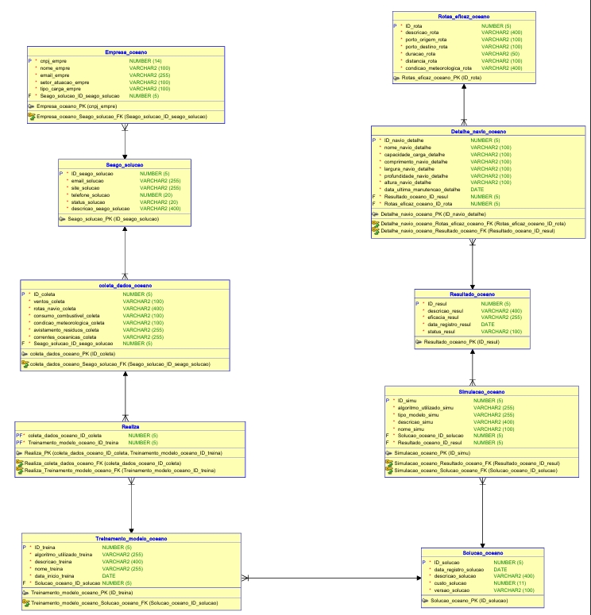

# 🌊SeaGO API #
Esse repositório trás a API referente ao Cadastro e Coleta de Dados para o projeto SeaGO, que tem como objetivo utilizar IA para calcular a melhor rota para navios comerciais por todo mundo. A API em qustão vai ser responsavel pelas funções de cadastro, login, locais possiveis para as rotas (Partida e Destino) e detalhes do navio.

👥 **Integrantes do Grupo:**

- RM98163 - Júlia Martins Santana Figueiredo
- RM550562 - Larissa Akemi Iwamoto
- RM98893 - Marcelo Henrique Góes da Costa Borgas
- RM98370 - Ricardo Brito Ponticelli Prieto
- RM94679 - Vinicios Becker Prediger

👤 **Responsaveis pelo projeto**

- RM98370 - Ricardo Brito Ponticelli Prieto

## [🎬Link do Vídeo Pitch]() ##

## [🎬Link do Vídeo de Explicação do Código Fonte](https://youtu.be/Ik7OzAqrCnA) ##

# [📋Endpoints da API] #

### *Os endpoints e requisições da API podem ser acessadas rodando a API e utilizando o link abaixo* ###
http://localhost:8080/swagger-ui/index.html#/

## 📊Diagrama de Classe/Modelo Lógico 

